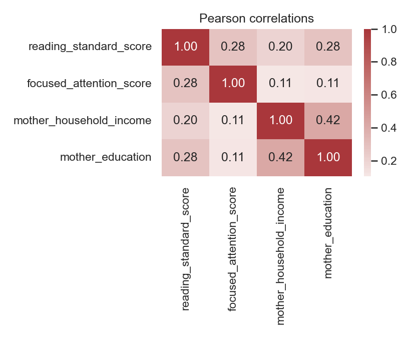
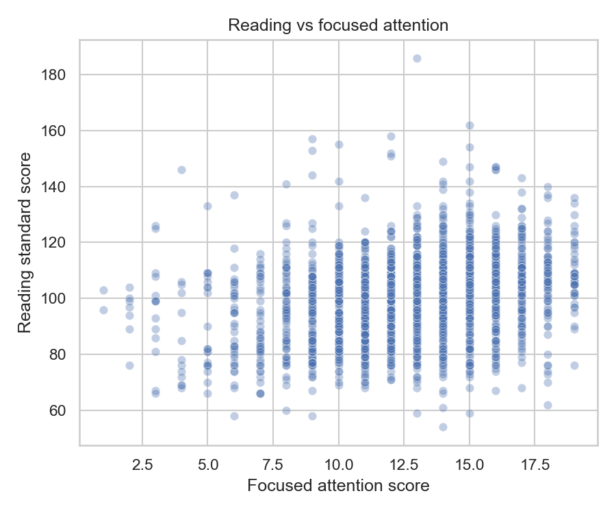
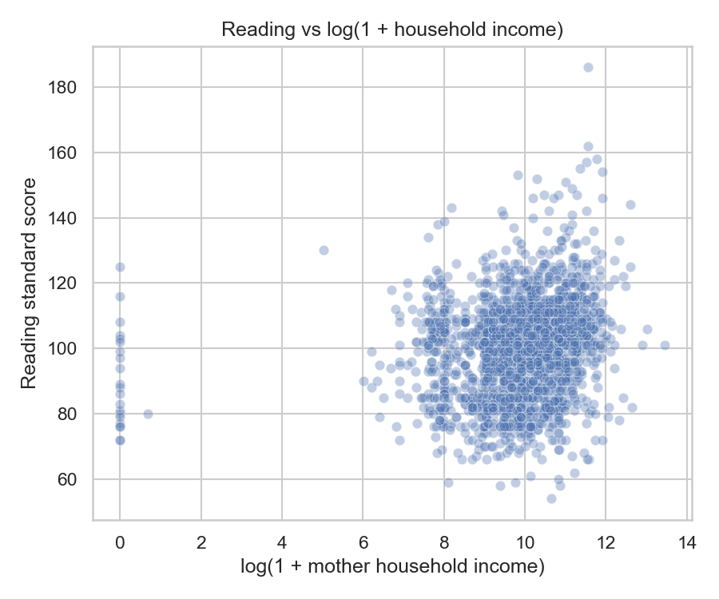

# Child development factors and performance (FFCWS subset)

Quick exploratory analysis linking **child reading scores**, **focused attention**, and **mother’s household income and education** using a small extract from the Future of Families and Child Wellbeing Study (FFCWS).

## Research question

Among children in this extract, how strongly are reading and attention scores associated with each other and with maternal socioeconomic measures? (Associations only—not causal claims.)

## Data

- **Study:** [The Future of Families and Child Wellbeing Study (FFCWS), Public Use, United States, 1998–2024 (ICPSR 31622)](https://doi.org/10.3886/ICPSR31622.v4).  
- **Official citation:** McLanahan, Sara, et al. *The Future of Families and Child Wellbeing Study (FFCWS), Public Use, United States, 1998-2024.* Inter-university Consortium for Political and Social Research [distributor], 2025-03-27. https://doi.org/10.3886/ICPSR31622.v4  
- **Raw file used here:** `31622-0001-Data.tsv` from the study download (kept **local**; not committed). Check ICPSR/FFCWS terms before redistributing any row-level extracts.

### Variables in this repo

| Column | Source variable (TSV) | Description |
|--------|------------------------|-------------|
| `id` | `IDNUM` | Respondent / record id |
| `reading_standard_score` | `CH4WJSS22` | Child reading standard score (wave coded in the FFCWS documentation) |
| `focused_attention_score` | `CH4LR_CORSCOR` | Focused attention score |
| `mother_household_income` | `CM4HHINC` | Mother-reported household income |
| `mother_education` | `CM4EDU` | Mother’s education (coded categories; see FFCWS codebook for labels) |

Full codebook detail stays in the **study documentation**; this table is only what this repository uses.

## Repository layout

```
scripts/dataset_prep.py    # Build CSVs from the local TSV
data/                      # Derived subsets (committed here for convenience)
notebooks/analysis.ipynb   # Figures + correlations + simple regression
figures/                   # Plots (regenerated by the notebook)
```

## Reproduce

1. Python 3.11+ recommended.  
2. Create a virtual environment and install dependencies:

   ```bash
   python3 -m venv .venv
   source .venv/bin/activate   # Windows: .venv\Scripts\activate
   pip install -r requirements.txt
   ```

3. Place the study TSV under `raw_data/31622-0001-Data.tsv` (create `raw_data` if needed).  
4. From the **repository root**:

   ```bash
   python scripts/dataset_prep.py
   jupyter notebook notebooks/analysis.ipynb
   ```

   Run all cells to refresh tables, models, and figures.

## Key findings (this subset)

- **Sample:** 2,073 rows with non-missing reading and attention; **2,072** complete cases on all four analysis columns (one missing `mother_education`).  
- **Correlation:** reading and focused attention **r ≈ 0.28** (moderate positive).  
- **Simple OLS** (outcome: reading standard score; predictors: focused attention, log(1 + income), mother’s education): **R² ≈ 0.15**. All three predictors are statistically significant in this specification; coefficients and diagnostics are in the notebook.  
- **Caveats:** cross-sectional associations; income is skewed so **log(1 + income)** is used; education is treated as a numeric step for simplicity (ordinal categories in the survey).







## License

- **Your code and text in this repository:** you may add a license file (e.g. MIT) for your own work.  
- **FFCWS data:** governed by ICPSR/FFCWS terms; this repo does not redistribute the raw TSV.
