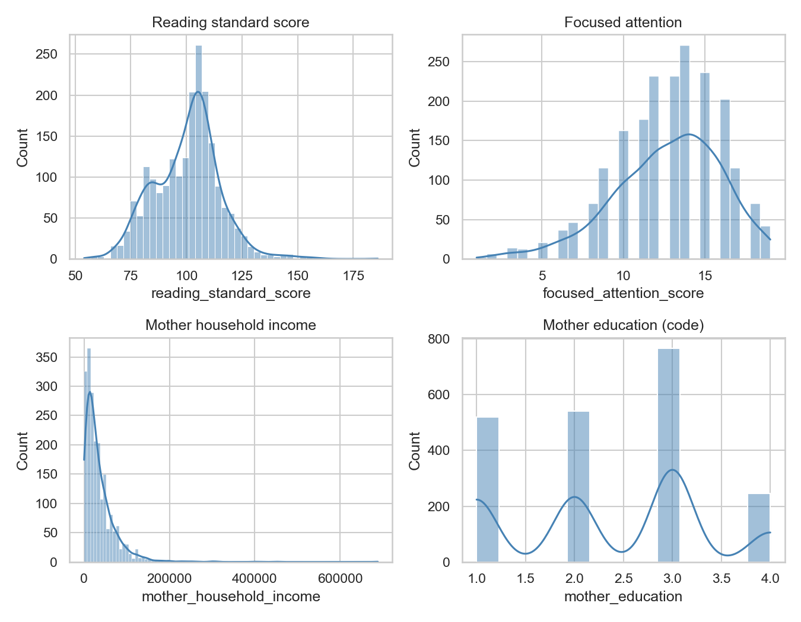
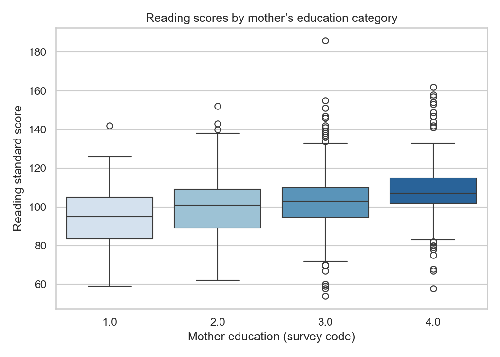
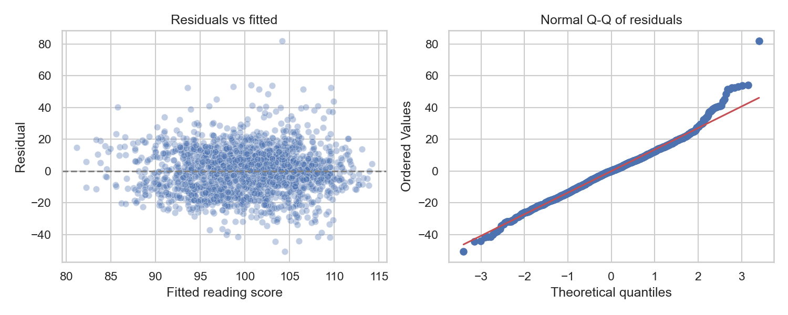

# Child development factors and performance (FFCWS subset)

Analysis of **child reading** and **focused attention** in relation to **mother’s household income** and **education**, using a small extract from the Future of Families and Child Wellbeing Study (FFCWS). This repository is structured so you can read the story in the README, inspect plots below, and reproduce everything in the Jupyter notebook.

---

## Research questions

1. How are **reading** and **focused attention** related to each other and to **maternal SES** (income, education) in this extract?
2. How much of the variation in reading scores is explained by **attention alone** versus **attention plus SES**?
3. If we flip the outcome and treat **attention** as the dependent variable, do **reading** and SES show a similar pattern? (Still associational only.)

**Important:** All statistics here describe **correlations and linear associations** in a convenience subset. They are **not** causal effects: unmeasured factors (genetics, school quality, parenting, prior development, etc.) could confound these relationships. For publication-quality work, use FFCWS documentation, weights where appropriate, and their citation rules.

---

## Data source

- **Study:** [The Future of Families and Child Wellbeing Study (FFCWS), Public Use, United States, 1998–2024 (ICPSR 31622)](https://doi.org/10.3886/ICPSR31622.v4).  
- **Citation:** McLanahan, Sara, et al. *The Future of Families and Child Wellbeing Study (FFCWS), Public Use, United States, 1998-2024.* Inter-university Consortium for Political and Social Research [distributor], 2025-03-27. https://doi.org/10.3886/ICPSR31622.v4  
- **Raw file used locally:** `31622-0001-Data.tsv` from the study download (not committed). Confirm ICPSR/FFCWS terms before sharing row-level extracts publicly.

### Variables used here

| Column | Source (TSV) | Role |
|--------|----------------|------|
| `id` | `IDNUM` | Record identifier |
| `reading_standard_score` | `CH4WJSS22` | Child reading standard score |
| `focused_attention_score` | `CH4LR_CORSCOR` | Focused attention score |
| `mother_household_income` | `CM4HHINC` | Mother-reported household income |
| `mother_education` | `CM4EDU` | Mother’s education (ordinal codes 1–4 in this file; labels in official codebook) |

Survey missing codes (`-1` … `-9`) are recoded to missing in [`scripts/dataset_prep.py`](scripts/dataset_prep.py). The analysis CSV keeps rows with non-missing reading and attention; the notebook uses **complete cases** on all four variables for models (**N = 2,072**; one case missing education).

---

## Methods (summary)

- **Descriptive:** histograms, education distribution, boxplots of reading by education.  
- **Bivariate:** Pearson correlations with two-sided tests.  
- **Regression:** OLS with **log(1 + income)** to limit leverage from skewed income.  
- **Model comparison:** nested **F-test** (M2 vs M1) for adding SES to attention.  
- **Diagnostics:** variance inflation factors (VIF); residuals vs fitted and normal Q-Q plot.  
- **Secondary model:** OLS with **focused attention** as outcome and reading + SES as predictors.

Full code, tables, and statistics: [`notebooks/analysis.ipynb`](notebooks/analysis.ipynb).

---

## Key results (complete-case sample, N = 2,072)

### Correlation

- **Reading vs focused attention:** *r* ≈ **0.28**, *p* &lt; 10⁻³⁵ (strong evidence of a linear association in this sample; magnitude is modest).

### Reading as outcome (OLS)

| Model | Predictors | R² | Adj. R² |
|-------|----------------|-----|---------|
| M1 | Attention only | ≈ 0.078 | — |
| M2 | Attention + log(1+income) + education | ≈ **0.147** | — |

- **Nested F-test (M2 vs M1):** *F* ≈ 83.2 on 2 df, *p* &lt; 10⁻³⁰ — adding income and education improves fit substantially under linear assumptions.  
- **M2 coefficients (approximate):** intercept ≈ 70.2; attention ≈ **1.09** points per attention score unit; log-income ≈ **0.85** per log-dollar increment; education ≈ **3.29** per one-step code, holding others fixed. See the notebook for standard errors, *t*-stats, and confidence intervals.

### Multicollinearity

- **VIF** (variance inflation factors) for the three predictors are roughly **13** (attention), **19** (log income), and **8** (education) in this sample — well above the informal **5–10** rule of thumb. Income, education, and attention overlap in linear terms, so **individual coefficients are not as stable** as when VIFs are near 1; the joint F-test and overall R² are still informative, but do not over-interpret one coefficient in isolation.

### Focused attention as outcome

- Regressing attention on reading, log-income, and education yields **R² ≈ 0.082** (lower than the reading model’s R² in this parameterization). Coefficients are in the notebook.

### Diagnostics

- Residual vs fitted plots and a normal Q-Q plot are saved as [`figures/residual_diagnostics.png`](figures/residual_diagnostics.png) for informal assessment of linear-model assumptions.

---

## Figures

**Distributions**



**Reading by mother’s education (survey code)**



**Correlation matrix**


**Bivariate relationships (with OLS line)**


**Residual diagnostics**



---

## Repository layout

```
scripts/dataset_prep.py       # Raw TSV → CSVs (run from repo root)
data/                         # Derived subsets
notebooks/analysis.ipynb      # Full analysis narrative + code
figures/                      # Plots (regenerated by the notebook)
requirements.txt
```

---

## Reproduce

```bash
python3 -m venv .venv
source .venv/bin/activate          # Windows: .venv\Scripts\activate
pip install -r requirements.txt
```

Place `31622-0001-Data.tsv` under `raw_data/`, then from the **repository root**:

```bash
python scripts/dataset_prep.py
jupyter notebook notebooks/analysis.ipynb
```

Run **Run → Run All** to refresh tables, models, and figures.

---

## License

- **Code and documentation in this repository:** Adding a `LICENSE` file (e.g. MIT) is optional; it makes reuse rights explicit for anyone browsing the project. This repo does not include one yet.  
- **FFCWS data** remain subject to ICPSR/FFCWS terms; the raw TSV is not redistributed here.
